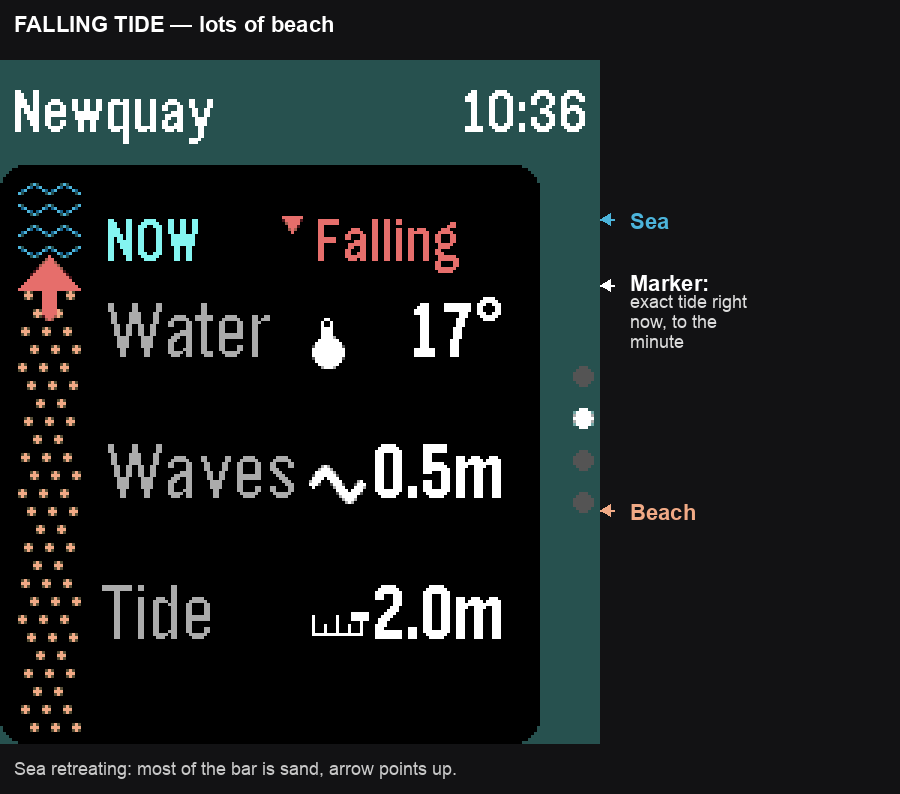
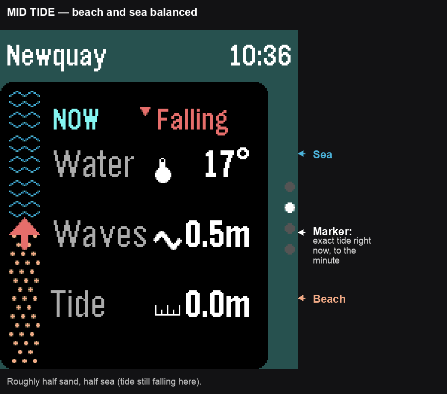
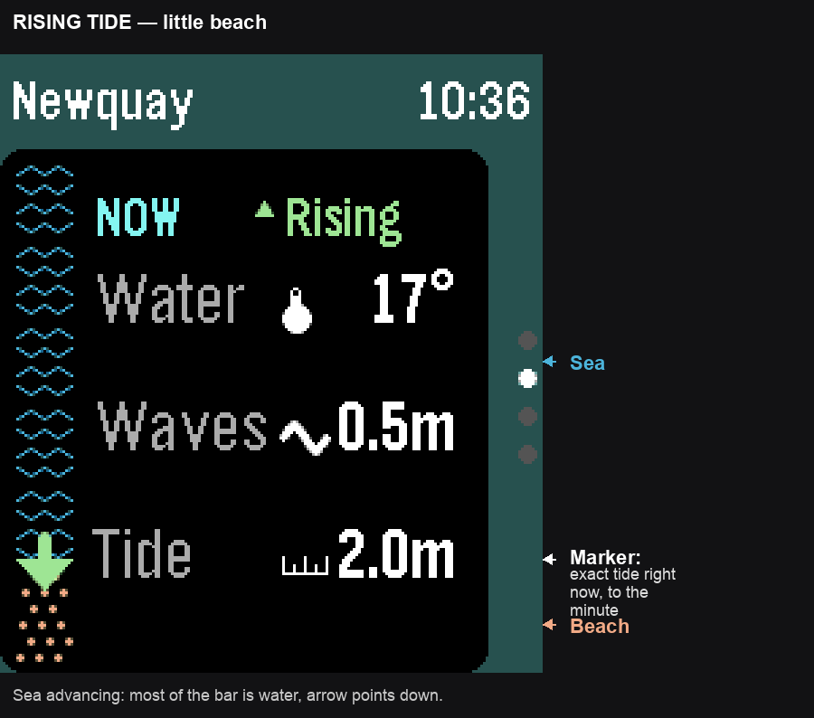

# TidePebble

Pebble watch app showing a 24-hour tide chart for the user's nearest location.

The JavaScript phone companion:

- Gets the phone location, falling back to phone location when unavailable.
- Uses BigDataCloud reverse geocoding to display a nearby place name.
- Fetches hourly marine sea-level data from Open-Meteo.
- Sends a compact tide series to the watch.

The watch app displays a blue tide-height chart, high and low tide labels, axis values, and a green interpolated marker for the current time.

## Beachometer

The vertical bar on the left of the Now/Overview pages ("beachometer") is a quick-glance gauge of how much beach is exposed right now. It's not a mini chart of the next few hours — it's a snapshot of *now*, always split into six hourly cells: sea (wave texture) filling from the top, beach (sand texture) from the bottom, sized by where the current tide height sits.

An arrow sits at the sea/beach boundary and points in the direction the tide is heading — down while rising (sea advancing over the beach), up while falling (sea retreating). Unlike the main beachometer with six hourly cells, the marker's position is in real time: it's placed at the exact tide height for the current minute.

This makes a bit more sense with some examples:

| Falling — lots of beach | Mid tide — balanced | Rising — little beach |
| --- | --- | --- |
|  |  |  |

## Build

```sh
cd tidepebble
pebble build
pebble install --emulator emery
```

The generated sideload bundle is `tidepebble/build/tidepebble.pbw`.

## Support

Tidepebble is free and always will be. If it's earned a spot on your watch, you can say thanks with a coffee. No pressure, entirely optional, and hugely appreciated.

Doctor's orders: one coffee a day. So it had better be a good one :-)

[](https://ko-fi.com/gordonbazeley)

[](https://github.com/sponsors/gordonbazeley)

## Data Sources

- Tide forecasts: [Open-Meteo Marine API](https://open-meteo.com/en/docs/marine-weather-api), sourced from DWD.
- Place names: [BigDataCloud reverse geocoding](https://www.bigdatacloud.com/free-api/free-reverse-geocode-to-city-api).
